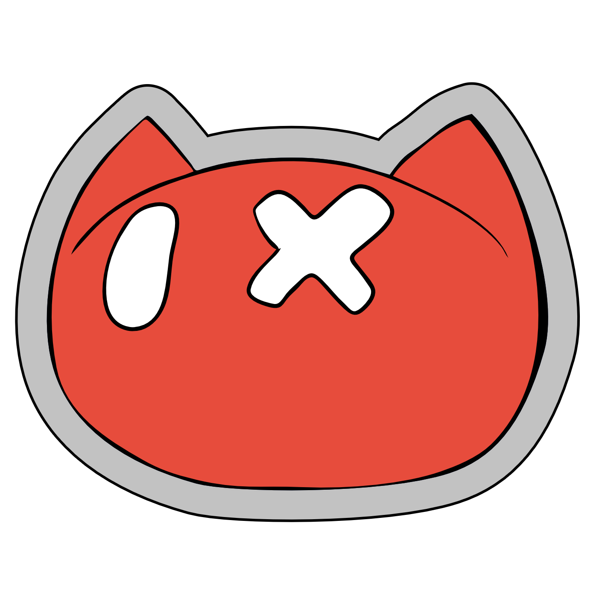

# 👋 Welcome to Schrödinger Hat

<!--  -->

    

Schrödinger Hat is a nonprofit association made of open source enthusiasts.
We organize events, create software, and grow communities to spread the love for open-source across Europe.

We believe in **free access to knowledge, collaborative innovation, and inclusive spaces** for developers, makers, and curious minds. Join us in building something meaningful, together.

## 🚀 How to Get Involved

Whether you're a seasoned hacker or just starting out, there's a place for you in our community.

### 🤝 Become a Member

Join our community as a member to get exclusive benefits, access to special events, and more.

[🌟 Become a Member](https://schroedinger-hat.org/association/join)

### 💬 Join the Conversation on Discord

Our Discord server is the beating heart of the community:
[discord.schroedinger-hat.org](https://discord.schroedinger-hat.org)

Chat with us about open source, contribute to discussions, share your projects, or just hang out.
Want to do more? Ask for one of our project or volunteer roles!

### 💻 Contribute Code on GitHub

We're always looking for contributors and maintainers for our open source projects: [-> Github Repositories](https://github.com/orgs/Schroedinger-Hat/repositories)

Got an idea for a new open source tool or project? We'd love to hear from you, write to us at: dev@schroedinger-hat.org

### 🎙️ Join the Podcast

We host an open tech podcast, created by the community.
Want to join an episode or propose your own? Hop into our [Discord channel](https://discord.schroedinger-hat.org) or message us at podcast@schroedinger-hat.org

[📻 Listen on Spotify](https://open.spotify.com/show/7yfkQCV6hrPIqflSqJDB2P)

### 🎉 Organize or Help Run Events

We organize meetups, workshops, and conferences throughout the year, like [OSDAY](https://osday.dev).
Volunteers are always needed, from logistics to speakers to streamers.

📩 Propose an event: events@schroedinger-hat.org

## 💡 How to Support Us

### 🦦 Sponsor or Get Sponsored

Want to support open source? We collect donation requests from individuals and organizations.

[💚 Open Collective](https://opencollective.com/schrodinger-hat)

### 🛒 Buy our Merch

Support us by buying our merch! All proceeds go towards funding our community initiatives and events.

[🛍️ Shop Now](https://shop.schroedinger-hat.org/)

### 📧 Subscribe to Our Newsletter

Stay updated with our latest news, events, and open source projects.

[📬 Subscribe Now](https://schroedinger-hat.org/association/newsletter)

### 🌐 Connect with Us

- [🌍 Website](https://schroedinger-hat.org)
- [💼 LinkedIn](https://www.linkedin.com/company/53115782)
- [📺 YouTube](https://www.youtube.com/c/schrodingerhat)
- [📷 Instagram](https://www.instagram.com/schroedinger_hat/)

Made with 💗 by the Schrödinger Hat community.
